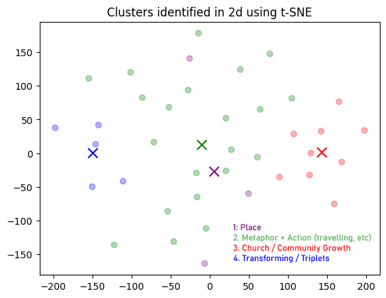

# Church of England Diocese Tagline Embedding Analysis

Code to run K-mean clustering on the taglines of various Church of England diocese.

- Cluster 1 (purple) are outliers, mentioning a place name, or in the case of Ely, a direct petition. (Ely, Exeter, London).
- Cluster 2 (green) are the "God", "Christ", "Jesus", "Faith" cluster but mostly also include a metaphorical verb "travelling", "journeying" etc. (e.g. Gloucester
Hereford, Leicester).
- Cluster 3 (red) are "church" and "change" (e.g, Manchester, Coventry, Derby)
- Cluster 4 (blue) are "the triplets" group (e.g. Leeds, Lincoln, Newcastle)

See `results.csv` in Excel for the full breakdown.

## Usage

### Fetching embeddings
1. Install Deno ^1.0.0 & Python ^3.9
2. Create a `.env` file with a `OPENAI_API_KEY` variable set to your OpenAI API key
3. Run `deno run --allow-env --allow-read --allow-write --allow-net fetch.ts`
4. Results are stored in `results.csv`
5. Install the Python dependencies in `requirements.txt` using `pip install -r requirements.txt`
6. You can then open the `dio.ipynb` in Jupyter to run the clustering

## Sources
Diocesan taglines were collected from [this X thread](https://twitter.com/TheDanGrayson/status/1743579845546656237) by @TheDanGrayson.

## Limitations

This code uses OpenAi's embeddings API which has risks and limitations, including social bias and "blindness to recent events". More information can be found [here](https://platform.openai.com/docs/guides/embeddings/limitations-risks).

## License
MIT
